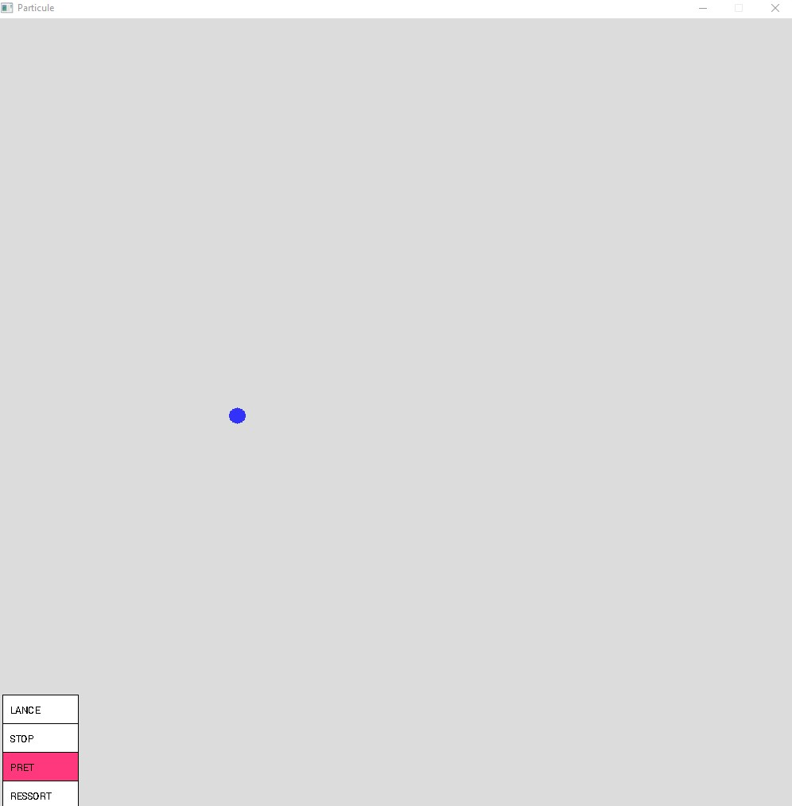
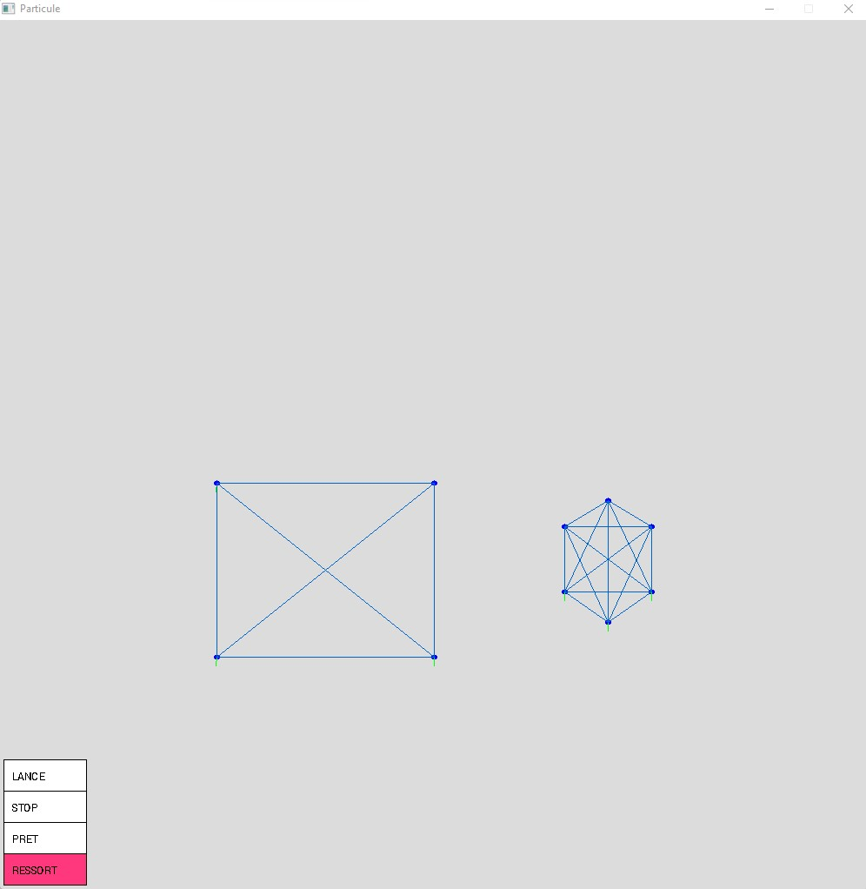
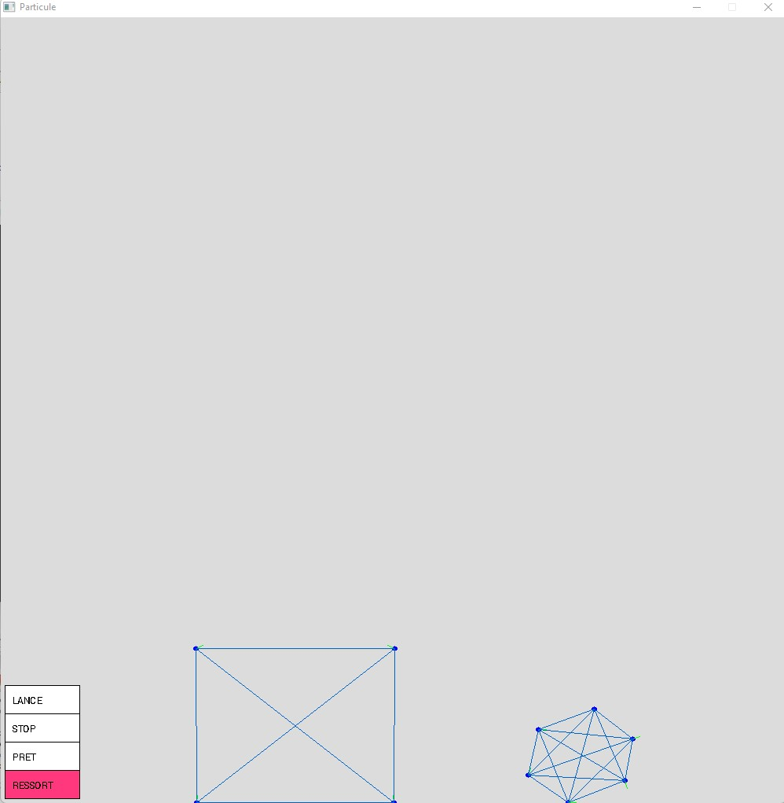

# Simulator Particle

Premierement j'ai creer une particule qui fonctionne seule (gravite, masse, collision):



Puis fais des groupement de ces particules relie par des ressorts:




# Subject

```
SEUL:

Nous allons noter pt la position au temps t, vt la vitesse au temps t et at l‘accélération au temps
t. L’accélération est la variation de la vitesse. Soit dt un intervalle de temps, petit, par exemple
10-3seconde (0.001 seconde). L’accélération est la variation de la vitesse :
t
dtttt a
dt
vv
dt
dv 

 
Nous pouvons faire de même pour la vitesse qui est la variation de position :
t
dttt v
dt
pp 
 

1. Calculez la nouvelle position en fonction de la vitesse et de la position au pas de temps
précédent.

2. Calculez la mise à jour de la vitesse en fonction de la vitesse au pas de temps précédent
et de l’accélération.

3. A partir de ces deux expressions et du principe fondamental de la dynamique, calculez
la position d’une particule en fonction des forces subies au temps t.

La position d’une particule se trouvant au point P peut s’écrire comme étant le vecteur OP, un
vecteur à 2 dimensions dans le cas du plan que nous allons traiter ici. La vitesse de la particule
est également un vecteur.

1. Écrivez en C++ la structure Vec2 qui stocke un vecteur à 2 dimensions. Vous pouvez
reprendre la structure Complex et la renommer. Prenez également les opérateurs +, -, *,
et /.

2. Écrivez en C++ la structure Particle qui stocke les informations nécessaires à une
simulation par le second principe de la dynamique (2e loi de Newton). Une particule est
représentée par une position, une vitesse, une force et une masse. Si la particule subit
plusieurs forces, les vecteurs forces seront sommés.

3. Écrivez la fonction partInit qui initialise une particule avec les paramètres suivants :
une position p, une vitesse v, et une masse m.

4. Écrivez la procédure void partAddForce(Particles& p, Vec2 force) qui ajoute une force
à la particule p.

5. Écrivez la procédure void partUpdatePV qui met à jour la vitesse et la position d’une
particule.

6. Écrivez le programme principal simulant et affichant une particule.
Remarque : il faut prévoir des forces, sinon la particule restera immobile.

7. Définissez la constante MAX_PART, ainsi que la structure World qui contient un
ensemble de particules. La structure World contiendra un tableau de MAX_PART
particules, ainsi que le nombre de particules réellement simulées dans le tableau.

8. Écrivez la procédure init qui prend en paramètres un monde World et un nombre de
particules à initialiser dans ce monde. Initialisez le vecteur vitesse des particules de
manière à avoir une fontaine.

Écrivez en même temps une fonction addParticle qui prend en paramètre un monde
World, une particule et qui renvoie l’indice de la particule ajoutée dans le tableau.

void addParticle(World& w , Particle p)

RESSORT:

Nous allons allez un peu plus loin avec la manipulation de particules en mouvement en
connectant deux particules ensemble avec un ressort.
La force de rappel élastique exercée par le ressort sur la masse m est

T = −k . Δl . er

où:

- er est un vecteur unitaire dirigé suivant l'axe du ressort, orienté vers l'extérieur.

- Δl=l−l0 est l'allongement du ressort en notant l la longueur du ressort, et l0 sa longueur à
vide.

- k est la raideur du ressort, intrinsèque au ressort considéré, elle caractérise la capacité du
ressort à résister au mouvement de la masse m, et par conséquent à revenir à sa position
d'équilibre

1. Définissez une structure Spring (ressort) s’adossant à la structure World contenant
l’ensemble des particules du monde. Vous pourrez utiliser l’indice d’une particule dans
le tableau comme identifiant.

2. Ajoutez un tableau de ressorts à la structure du monde World.

3. Modifiez la procédure init qui initialise le monde pour qu’elle créé également les
ressorts. Nous vous conseillons d’écrire une structure addParticle qui renvoie l’indice
de la particule ajoutée. Vous pourrez commencer par créer 2 particules reliées par un
ressort, puis faire un triangle, puis un carré, etc.
procedure addParticle(w : donnée/Resultat World)

4. Modifiez la procédure draw pour qu’elle affiche les ressorts représentés par des lignes.

5. Ecrivez la procédure computeParticleForceSpring qui calcule les forces qu’exercent les
ressorts sur toutes les particules du monde.

COLLISION:

Sur terre, une approximation de la force que subit une particule soumise à l’attraction terrestre
est le poids, avec m la masse et G est la constante de gravitation universelle G=9.81 :
P = m.G

1. Ajoutez une structure World qui va stocker plusieurs particules dans un tableau. En
complément de la structure, programmez une fonction init.

2. Ajoutez à votre programme cette force de gravité pour que vos particules « tombent ».
Pour la gestion des collisions nous allons considérer uniquement des murs horizontaux ou
verticaux : x=0, y=0, x=Xmax , y=Ymax

3. Modifiez le code de la fonction update pour intégrer ces collisions. Vous devriez obtenir
des particules qui rebondissent dans la boite de l’écran. Le test de collision est assez
simple : if (x<0) { … }

La réaction à une collision peut se faire en remettant artificiellement la particule dans le
rectangle de la simulation : x = -x ;

Il faut aussi réorienter le vecteur vitesse de manière symétrique : vx = -vx

4. Après un choc une particule perd un peu de vitesse (énergie) absorbée par le mur. Ceci
se fait en réduisant le vecteur vitesse : v = -FRICTION * v où FRICTION est une
constante inférieure à 1, par exemple 0.6.

```

# GrAPiC 

## Starting

Linux, Windows and Mac instruction :

http://licence-info.univ-lyon1.fr/grapic

## Introduction

GrAPiC is a small, easy-to-use framework to add graphical functionalities to your C/C++ code. 
Its main goal is to provide easy graphical functions to be used in introduction courses of algorithm and programming in C/C++. 
It is based on SDL2 but to use it you need to know only few very simples functions. 
The Grapic archive comes with the needed SDL part, you do not have to install SDL. Just unzip and enjoy ! 

## Starting

Compiling from the github (which is not the standard way).

* On Linux you need to install:
- g++
- doxygen
- zip
- lib-sdl2-dev lib-sdl2 sd2_image... sdl2_ttf...

1. sudo apt install g++ premake4 zip doxygen libsdl2-dev libsdl2-mixer-dev libsdl2-image-dev
2. make premake
3. make
(4. script/make_linux_test.sh): to test the archive doc/download/grapic-linux.tgz
(5. script/make_web.sh): to create the zip files in doc/download or to sync everything to the webpage (need passwd).


* On windows
0. Install CB 20
1. run premake-cb20.bat to generate the projects files    or     run premake-lifami.bat to generate lifami projects 
2. open build/windows-cb20/grapic.workspace

## Best way to make a projet in windows

(windows): 
 - Open build/windows-cb20/grapic.workspace in CodeBlocks
 - In the left part (Management) of the logiciel, double clic in the projet of yours choice (it's those in /apps)
 - Finally clic in the green arrow in the top of the screen


## Put your new project in GraPic

Add your directory with your cpp files in "apps" and add the path in "premake4".

